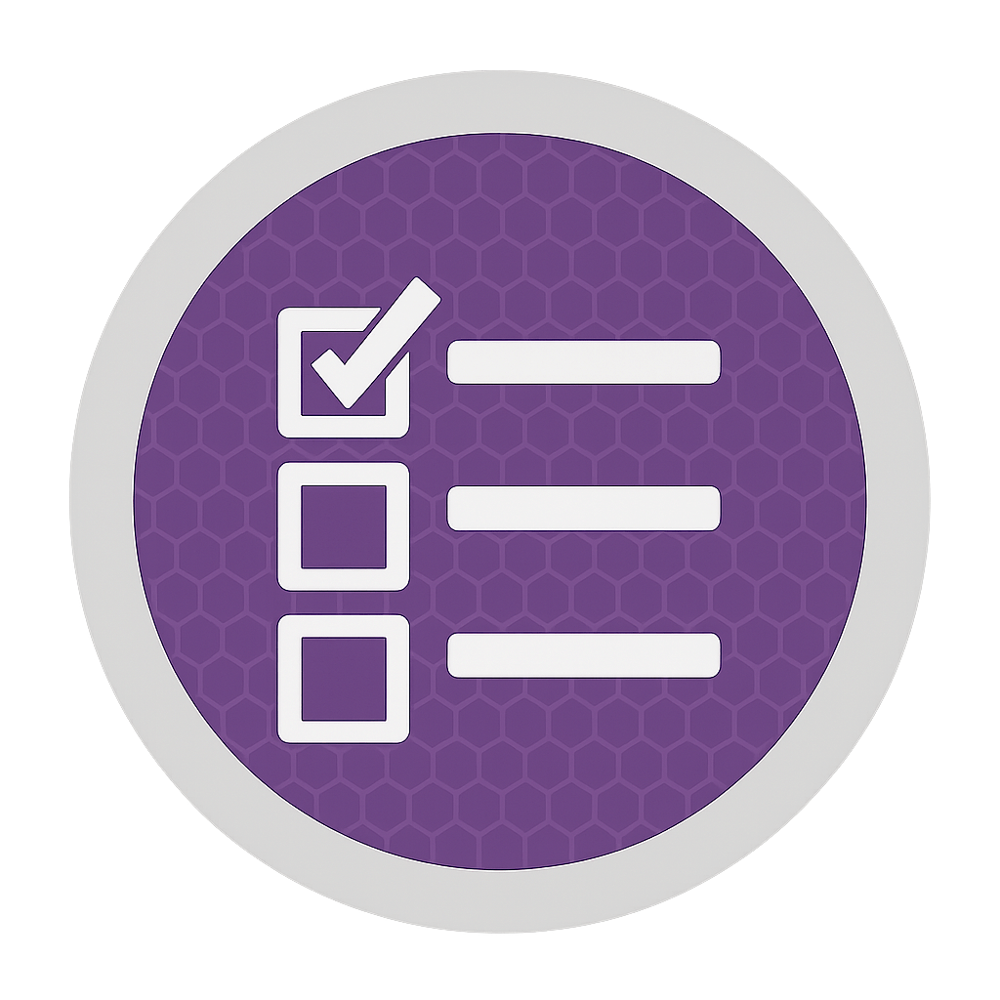

<div align="center">
  

  # Listarr

  **Automatically sync your Letterboxd and MyAnimeList watchlists to Radarr and Sonarr**

  [](https://github.com/kristianvld/listarr/releases)
  [](https://github.com/kristianvld/listarr/pkgs/container/listarr)
  [](LICENSE)
  [](https://github.com/kristianvld/listarr/actions)
</div>

## What is Listarr?

Listarr automatically monitors your Letterboxd watchlists and MyAnimeList "Plan to Watch" lists, then exposes them as custom lists that Radarr and Sonarr can consume. No more manually adding movies and shows—just add them to your watchlists and Listarr handles the rest.

**No authentication required!** Listarr only uses publicly available information from Letterboxd and MyAnimeList. No login credentials, API tokens, or private data needed—just usernames.

### Key Benefits

- 🔓 **No Authentication Required**: Uses only public watchlist data—no login credentials or API tokens needed
- 🎬 **Seamless Integration**: Works directly with Radarr and Sonarr's built-in custom list feature
- 🔄 **Automatic Sync**: Periodically checks your watchlists and updates Radarr/Sonarr automatically
- 🎯 **Smart ID Mapping**: Automatically resolves titles to TMDB/TVDB IDs for accurate matching
- 📱 **Multi-Source Support**: Combine watchlists from multiple Letterboxd and MyAnimeList users
- 🔔 **Discord Notifications**: Get notified when new content is discovered (optional)
- 🐳 **Docker Ready**: Pre-built images available, up and running in minutes

## Quick Start

### Using Docker Compose (Recommended)

The easiest way to get started is using the pre-built Docker image from GitHub Container Registry:

1. Create a `docker-compose.yml` file:

```yaml
services:
  listarr:
    image: ghcr.io/kristianvld/listarr:latest
    container_name: listarr
    restart: unless-stopped
    ports:
      - "3000:3000"
    environment:
      # Letterboxd users (comma or space separated)
      - LETTERBOXD_USERS=username1,username2
      # MyAnimeList users (comma or space separated)
      - MYANIMELIST_USERS=username1,username2
      # Discord webhook (optional, leave empty to disable)
      - DISCORD_WEBHOOK=
      # Refresh interval in seconds (optional, defaults to 300)
      - REFRESH_INTERVAL=300
    volumes:
      # Persist announced.jsonl across restarts
      - ./data:/app/data:rw
```

2. Start the container:

```bash
docker-compose up -d
```

3. Check the logs:

```bash
docker-compose logs -f
```

The application will start scraping your configured watchlists and expose endpoints for Radarr and Sonarr.

### Using Bun (Development)

1. Install dependencies:
```bash
bun install
```

2. Copy and configure `config.json`:
```bash
cp config.example.json config.json
# Edit config.json with your settings
```

3. Run the application:
```bash
bun run src/index.ts
```

## Configuration

Configuration can be provided via:
1. Environment variables (highest priority)
2. `config.json` file
3. Defaults (lowest priority)

### Environment Variables

- `LETTERBOXD_USERS` - Comma or space-separated list of Letterboxd usernames
- `MYANIMELIST_USERS` - Comma or space-separated list of MyAnimeList usernames
- `DISCORD_WEBHOOK` - Discord webhook URL (optional)
- `PORT` - Server port (default: 3000)
- `REFRESH_INTERVAL` - Refresh interval in seconds (default: 300)
- `DATA_DIR` - Directory for persistent storage (default: current directory)

### Config File

See `config.example.json` for the structure. The config file is optional if you're using environment variables.

## API Endpoints

The application exposes the following endpoints for Radarr and Sonarr:

- `GET /radarr/anime` - Anime movies (TMDB IDs)
- `GET /radarr/movies` - Non-anime movies (TMDB IDs)
- `GET /sonarr/anime` - Anime TV shows (TVDB IDs)
- `GET /sonarr/shows` - Non-anime TV shows (TVDB IDs)

### Setting up in Radarr/Sonarr

1. In Radarr/Sonarr, go to Settings → Lists
2. Add a new "Custom List"
3. Set the URL to: `http://your-server:3000/radarr/anime` (or the appropriate endpoint)
4. Configure the list settings as needed

## How It Works

1. **Scraping**: The application periodically scrapes watchlists from configured Letterboxd and MyAnimeList users
2. **ID Resolution**: It maps titles to TMDB/TVDB IDs using lookup databases
3. **Deduplication**: Entries are tracked in `announced.jsonl` to prevent duplicates
4. **Endpoints**: Radarr and Sonarr can query the endpoints to get lists of content to add
5. **Notifications**: Optional Discord notifications are sent when new content is found

## Releases

To create a new release:

```bash
# Create a patch release (default)
./scripts/release.sh

# Create a minor release
./scripts/release.sh minor

# Create a major release
./scripts/release.sh major
```

This will:
1. Calculate the next version based on the latest tag
2. Create a new git tag
3. Push the tag to GitHub
4. Trigger GitHub Actions to build and publish the Docker image

## Development

```bash
# Install dependencies
bun install

# Run in development
bun run src/index.ts
```

## License

This project is licensed under the MIT License - see the [LICENSE](LICENSE) file for details.
